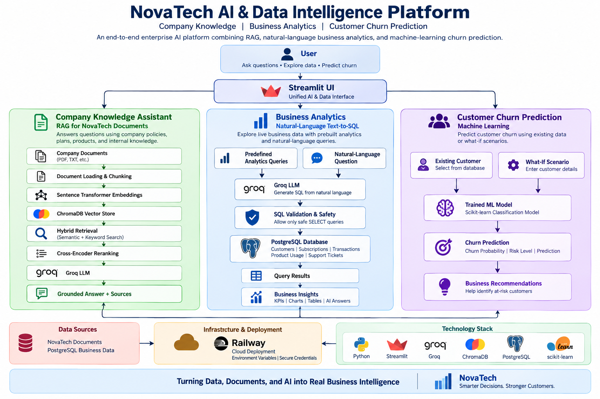
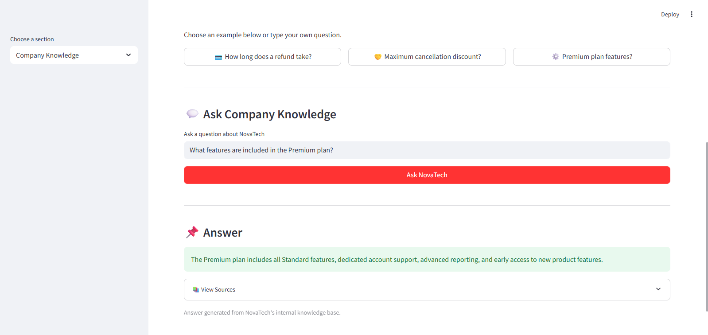
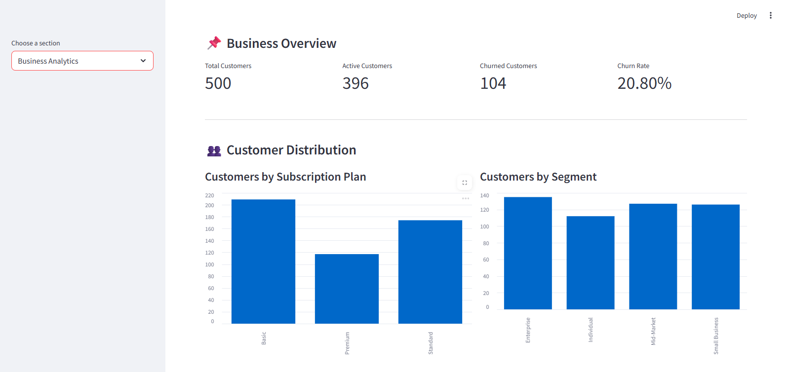
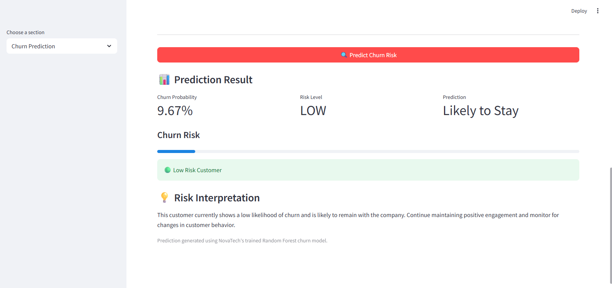

# NovaTech AI & Data Intelligence Platform

An end-to-end enterprise AI and data intelligence platform that combines **Retrieval-Augmented Generation (RAG)**, **natural-language business analytics with Text-to-SQL**, and **machine-learning-based customer churn prediction** in a unified Streamlit application.

The platform demonstrates how generative AI, structured business data, information retrieval, and predictive machine learning can be integrated into a production-style application.

---

## 🚀 Project Overview

NovaTech AI & Data Intelligence Platform contains three major AI and analytics capabilities:

### 💬 Company Knowledge Assistant
A Retrieval-Augmented Generation (RAG) system that answers questions using NovaTech company documents and policies.

### 📊 Business Analytics
An interactive analytics dashboard connected to PostgreSQL with KPI visualizations and natural-language Text-to-SQL querying.

### 🎯 Customer Churn Prediction
A machine-learning system that estimates customer churn probability and provides a risk classification for existing customers and hypothetical scenarios.

---

## ✨ Key Features

### Company Knowledge — RAG

- Loads and chunks company documents
- Generates semantic embeddings
- Stores document embeddings in ChromaDB
- Uses hybrid semantic + keyword retrieval
- Applies cross-encoder reranking
- Builds grounded context from relevant document chunks
- Uses Groq-hosted LLM inference for answer generation
- Displays document sources with responses
- Avoids answering unsupported questions when information is not available in the supplied company documents

Example questions:

```text
What is the refund policy?
How long does a refund take?
Explain the cancellation policy.
What is the maximum cancellation discount?
What features are included in the Premium plan?
What subscription plans are available?
```

---

### Business Analytics

The Business Analytics module connects directly to a PostgreSQL database containing customer, subscription, transaction, product-usage, and support-ticket data.

Dashboard capabilities include:

- Total customer KPI
- Total revenue KPI
- Customer churn rate
- Average revenue per customer
- Revenue by customer segment
- Customers by subscription plan
- Churn rate by subscription plan
- Customers by country
- Product usage analytics
- Customer support analytics
- Detailed customer analytics table

---

## 🤖 Natural-Language Text-to-SQL

Users are not restricted to predefined analytics questions.

The platform can translate natural-language business questions into PostgreSQL queries using an LLM.

Example:

```text
Show the top 5 customers by total revenue.
```

Conceptual flow:

```text
Natural-Language Question
          ↓
     Groq LLM
          ↓
   SQL Generation
          ↓
  SQL Safety Validation
          ↓
      PostgreSQL
          ↓
   Business Answer
```

Example analytics questions:

```text
Which country generates the most revenue?
Show revenue by customer segment.
Show the top 5 customers by total revenue.
What is the overall churn rate?
Show churn rate by subscription plan.
Which customer segment has the highest average transaction value?
Compare average product usage across customer segments.
Which customers have the most support tickets?
```

---

## 🔐 Text-to-SQL Safety

LLM-generated SQL is validated before database execution.

The safety layer is designed to:

- Allow read-only `SELECT` queries
- Reject unsupported queries
- Block database-modifying commands
- Block commands such as `INSERT`, `UPDATE`, `DELETE`, `DROP`, `ALTER`, `TRUNCATE`, `CREATE`, `GRANT`, `REVOKE`, and `COPY`
- Prevent multiple SQL statements from being executed in one request

This provides an additional safety boundary between the LLM and PostgreSQL.

---

## 🎯 Customer Churn Prediction

The machine-learning module predicts whether a customer is at risk of churn.

The model uses customer information such as:

- Customer segment
- Country
- Subscription plan
- Monthly price
- Customer tenure
- Support ticket count
- Average login activity
- Feature usage
- Average session duration

The interface supports two prediction modes.

### Existing Customer

Select a customer already stored in PostgreSQL and generate a churn prediction using their customer profile.

### What-If Scenario

Enter hypothetical customer characteristics and evaluate how those characteristics affect predicted churn risk.

The output includes:

- Churn probability
- Risk level
- Predicted customer outcome


---

## 🏗️ System Architecture

The NovaTech platform integrates Retrieval-Augmented Generation (RAG), natural-language business analytics, PostgreSQL, and machine learning within a unified Streamlit application.



---


## 🗄️ Database Design

The PostgreSQL database contains five primary business tables:

### `customers`

Stores customer profile information.

### `subscriptions`

Stores subscription plans, monthly pricing, subscription status, and churn information.

### `transactions`

Stores customer transaction amounts and transaction dates/types.

### `product_usage`

Stores product engagement information including logins, feature usage, and session duration.

### `support_tickets`

Stores customer support activity including issue type, priority, status, and resolution time.

The tables are connected using:

```text
customer_id
```

as the primary customer relationship key.

---

## 🛠️ Technology Stack

### Programming

- Python

### User Interface

- Streamlit

### Generative AI

- Groq API
- LLM-based response generation
- LLM-based Text-to-SQL

### Retrieval-Augmented Generation

- ChromaDB
- Sentence Transformers
- Hybrid search
- Cross-encoder reranking

### Machine Learning

- Scikit-learn
- Customer churn classification

### Data & Database

- PostgreSQL
- Pandas
- Psycopg2

### Deployment & Development

- Railway
- Git
- GitHub
- VS Code

---

## 📁 Project Structure

```text
enterprise-rag-platform/
│
├── app/
│   └── streamlit_app.py
│
├── src/
│   │
│   ├── analytics/
│   │   ├── sql_analytics.py
│   │   └── text_to_sql.py
│   │
│   ├── data_generation/
│   │   └── generate_business_data.py
│   │
│   ├── embeddings/
│   │   └── create_embeddings.py
│   │
│   ├── generation/
│   │   └── test_llm.py
│   │
│   ├── ingestion/
│   │   ├── chunk_documents.py
│   │   └── load_documents.py
│   │
│   ├── ML/
│   │   ├── predict_churn.py
│   │   └── train_churn_model.py
│   │
│   ├── retrieval/
│   │   ├── hybrid_search.py
│   │   ├── keyword_search.py
│   │   ├── rag_pipeline.py
│   │   ├── reranker.py
│   │   └── search.py
│   │
│   ├── router/
│   │   ├── query_router.py
│   │   └── unified_assistant.py
│   │
│   └── utils/
│
├── documents/
├── data/
├── requirements.txt
└── README.md
```

---

## 🔄 Query Routing

The application separates different types of user requests into specialized workflows:

```text
Company Knowledge
      ↓
RAG Pipeline

Business Analytics
      ↓
PostgreSQL / Text-to-SQL

Churn Prediction
      ↓
Machine-Learning Model
```

This architecture allows each task to use the most appropriate data source and processing method.

---

## 💻 Running the Project Locally

### 1. Clone the repository

```bash
git clone <repository-url>
cd enterprise-rag-platform
```

### 2. Create a virtual environment

```bash
python -m venv .venv
```

Activate it on Windows:

```bash
.venv\Scripts\activate
```

### 3. Install dependencies

```bash
pip install -r requirements.txt
```

### 4. Configure environment variables

Create a `.env` file locally.

```env
GROQ_API_KEY=your_groq_api_key

DB_HOST=your_database_host
DB_PORT=your_database_port
DB_NAME=your_database_name
DB_USER=your_database_user
DB_PASSWORD=your_database_password
```

Never commit the `.env` file or credentials to GitHub.

### 5. Run the Streamlit application

```bash
streamlit run app/streamlit_app.py
```

---

## ☁️ Deployment

The application is deployed using Railway.

The production environment uses Railway environment variables for sensitive configuration such as:

- Groq API credentials
- PostgreSQL host
- PostgreSQL port
- Database name
- Database username
- Database password

Secrets are not stored directly in the application source code.

---

## 📸 Application Screenshots

### 💬 Company Knowledge — RAG Assistant

Ask questions about NovaTech policies, subscription plans, refunds, cancellations, and product information using Retrieval-Augmented Generation.



---

### 📊 Business Analytics — AI Text-to-SQL Dashboard

Explore live PostgreSQL business data through KPI dashboards, visual analytics, predefined queries, and natural-language Text-to-SQL.



---

### 🎯 Customer Churn Prediction

Predict customer churn using existing customer data or simulate new customer scenarios using the trained machine-learning model.



## 🔮 Future Improvements

Potential extensions include:

- Conversation history for follow-up questions
- More advanced SQL parsing and validation
- Query-result visualizations generated dynamically from Text-to-SQL
- Authentication and role-based access control
- RAG evaluation metrics
- ML model monitoring and drift detection
- Persistent vector storage for production deployments
- Automated data refresh pipelines
- Additional predictive business models

---

## 🎓 Skills Demonstrated

This project demonstrates practical experience with:

- Generative AI
- Retrieval-Augmented Generation
- Large Language Models
- Prompt engineering
- Embeddings
- Vector databases
- Semantic search
- Hybrid retrieval
- Cross-encoder reranking
- Natural-language-to-SQL
- PostgreSQL
- SQL safety validation
- Machine learning
- Churn prediction
- Data analytics
- Streamlit application development
- Git/GitHub
- Cloud deployment

---

## 👤 Author

**Sathvika Donthireddy**

M.S. Data Science & Analytics

---

## 📄 Project Purpose

This project was developed as a portfolio project to demonstrate the integration of modern **AI, machine learning, data engineering, retrieval, and business analytics** techniques in an end-to-end deployed application.